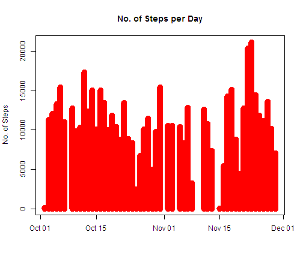
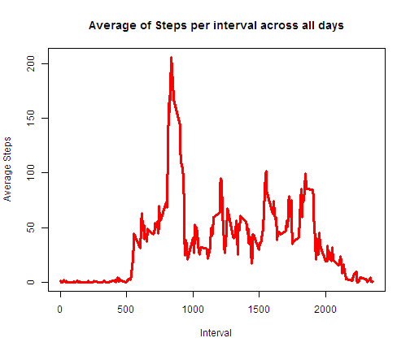
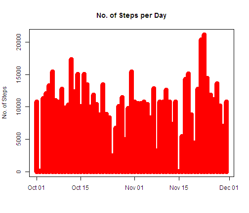
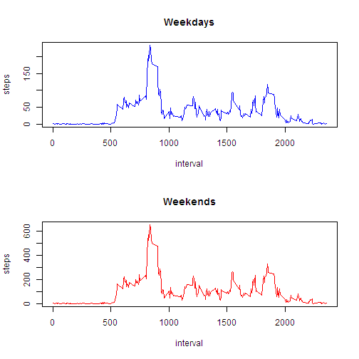

REPRODUCIBLE RESEARCH PROJECT 1
========================================================
1.Loading and Processing Data

```r
data <- read.csv("C:/activity.csv")
str(data)
```

```
## 'data.frame':	17568 obs. of  3 variables:
##  $ steps   : int  NA NA NA NA NA NA NA NA NA NA ...
##  $ date    : Factor w/ 61 levels "2012-10-01","2012-10-02",..: 1 1 1 1 1 1 1 1 1 1 ...
##  $ interval: int  0 5 10 15 20 25 30 35 40 45 ...
```


2.1 We first check the data without the rows with NA

```r
clean <- na.omit(data)
str(clean)
```

```
## 'data.frame':	15264 obs. of  3 variables:
##  $ steps   : int  0 0 0 0 0 0 0 0 0 0 ...
##  $ date    : Factor w/ 61 levels "2012-10-01","2012-10-02",..: 2 2 2 2 2 2 2 2 2 2 ...
##  $ interval: int  0 5 10 15 20 25 30 35 40 45 ...
##  - attr(*, "na.action")=Class 'omit'  Named int [1:2304] 1 2 3 4 5 6 7 8 9 10 ...
##   .. ..- attr(*, "names")= chr [1:2304] "1" "2" "3" "4" ...
```


```r
head(clean, 20)
```

```
##     steps       date interval
## 289     0 2012-10-02        0
## 290     0 2012-10-02        5
## 291     0 2012-10-02       10
## 292     0 2012-10-02       15
## 293     0 2012-10-02       20
## 294     0 2012-10-02       25
## 295     0 2012-10-02       30
## 296     0 2012-10-02       35
## 297     0 2012-10-02       40
## 298     0 2012-10-02       45
## 299     0 2012-10-02       50
## 300     0 2012-10-02       55
## 301     0 2012-10-02      100
## 302     0 2012-10-02      105
## 303     0 2012-10-02      110
## 304     0 2012-10-02      115
## 305     0 2012-10-02      120
## 306     0 2012-10-02      125
## 307     0 2012-10-02      130
## 308     0 2012-10-02      135
```


2.2 Summarize the data by Date

```r
library(reshape2)
melted <- melt(clean, id = c("date"), measures.vars = steps)
subjMelt <- dcast(melted, date ~ variable, sum)
subjMelt
```

```
##          date steps interval
## 1  2012-10-02   126   339120
## 2  2012-10-03 11352   339120
## 3  2012-10-04 12116   339120
## 4  2012-10-05 13294   339120
## 5  2012-10-06 15420   339120
## 6  2012-10-07 11015   339120
## 7  2012-10-09 12811   339120
## 8  2012-10-10  9900   339120
## 9  2012-10-11 10304   339120
## 10 2012-10-12 17382   339120
## 11 2012-10-13 12426   339120
## 12 2012-10-14 15098   339120
## 13 2012-10-15 10139   339120
## 14 2012-10-16 15084   339120
## 15 2012-10-17 13452   339120
## 16 2012-10-18 10056   339120
## 17 2012-10-19 11829   339120
## 18 2012-10-20 10395   339120
## 19 2012-10-21  8821   339120
## 20 2012-10-22 13460   339120
## 21 2012-10-23  8918   339120
## 22 2012-10-24  8355   339120
## 23 2012-10-25  2492   339120
## 24 2012-10-26  6778   339120
## 25 2012-10-27 10119   339120
## 26 2012-10-28 11458   339120
## 27 2012-10-29  5018   339120
## 28 2012-10-30  9819   339120
## 29 2012-10-31 15414   339120
## 30 2012-11-02 10600   339120
## 31 2012-11-03 10571   339120
## 32 2012-11-05 10439   339120
## 33 2012-11-06  8334   339120
## 34 2012-11-07 12883   339120
## 35 2012-11-08  3219   339120
## 36 2012-11-11 12608   339120
## 37 2012-11-12 10765   339120
## 38 2012-11-13  7336   339120
## 39 2012-11-15    41   339120
## 40 2012-11-16  5441   339120
## 41 2012-11-17 14339   339120
## 42 2012-11-18 15110   339120
## 43 2012-11-19  8841   339120
## 44 2012-11-20  4472   339120
## 45 2012-11-21 12787   339120
## 46 2012-11-22 20427   339120
## 47 2012-11-23 21194   339120
## 48 2012-11-24 14478   339120
## 49 2012-11-25 11834   339120
## 50 2012-11-26 11162   339120
## 51 2012-11-27 13646   339120
## 52 2012-11-28 10183   339120
## 53 2012-11-29  7047   339120
```


2.3 Create Histogram of the total number of steps taken each day

```r
plot(as.Date(subjMelt[, 1]), subjMelt[, 2], type = "h", lwd = 10, xlab = "", 
    ylab = "No. of Steps", main = "No. of Steps per Day", col = "red")
```

 


2.4 Calculate and report the mean and median total number of steps taken per day

```r
summary(subjMelt[, 2])
```

```
##    Min. 1st Qu.  Median    Mean 3rd Qu.    Max. 
##      41    8840   10800   10800   13300   21200
```


3.1 Make a time series plot (i.e. type = "l") of the 5-minute interval (x-axis) and the average number of steps taken, averaged across all days (y-axis)

```r

silver <- melt(clean, id = c("date", "interval"), measures.vars = steps)
gold <- dcast(silver, interval ~ variable, mean)
head(gold, 30)
```

```
##    interval   steps
## 1         0 1.71698
## 2         5 0.33962
## 3        10 0.13208
## 4        15 0.15094
## 5        20 0.07547
## 6        25 2.09434
## 7        30 0.52830
## 8        35 0.86792
## 9        40 0.00000
## 10       45 1.47170
## 11       50 0.30189
## 12       55 0.13208
## 13      100 0.32075
## 14      105 0.67925
## 15      110 0.15094
## 16      115 0.33962
## 17      120 0.00000
## 18      125 1.11321
## 19      130 1.83019
## 20      135 0.16981
## 21      140 0.16981
## 22      145 0.37736
## 23      150 0.26415
## 24      155 0.00000
## 25      200 0.00000
## 26      205 0.00000
## 27      210 1.13208
## 28      215 0.00000
## 29      220 0.00000
## 30      225 0.13208
```


Plot

```r
plot(gold[, 1], gold[, 2], type = "l", lwd = 3, xlab = "Interval", ylab = "Average Steps", 
    main = "Average of Steps per interval across all days", col = "red")
```

 


3.2 Which 5-minute interval, on average across all the days in the dataset, contains the maximum number of steps?

```r
subset(gold, gold[, 2] == max(gold[, 2]))
```

```
##     interval steps
## 104      835 206.2
```


4.1 Calculate and report the total number of missing values in the dataset 
Sum of rows with NA values

```r
sum(is.na(data$steps))
```

```
## [1] 2304
```


4.2 Devise a strategy for filling in all of the missing values in the dataset. The strategy does not need to be sophisticated. For example, you could use the mean/median for that day, or the mean for that 5-minute interval, etc.

 We will consider the mean of the the average of Steps per Day. We will use this mean to fill in the missing values


```r
mean <- sum(subjMelt[, 2])/53
mean
```

```
## [1] 10766
```


4.3 Create a new dataset that is equal to the original dataset but with the missing data filled in.


```r

melted <- melt(data, id = c("date"), measures.vars = steps)
subjMelt <- dcast(melted, date ~ variable, sum)
subjMelt[is.na(subjMelt)] <- mean
head(subjMelt, 10)
```

```
##          date steps interval
## 1  2012-10-01 10766   339120
## 2  2012-10-02   126   339120
## 3  2012-10-03 11352   339120
## 4  2012-10-04 12116   339120
## 5  2012-10-05 13294   339120
## 6  2012-10-06 15420   339120
## 7  2012-10-07 11015   339120
## 8  2012-10-08 10766   339120
## 9  2012-10-09 12811   339120
## 10 2012-10-10  9900   339120
```


4.4 Make a histogram of the total number of steps taken each day and Calculate and report the mean and median total number of steps taken per day


```r
plot(as.Date(subjMelt[, 1]), subjMelt[, 2], type = "h", lwd = 10, xlab = "", 
    ylab = "No. of Steps", main = "No. of Steps per Day", col = "red")
```

 


We take the summary of the No. of Steps per Day to see its mean and median

```r
summary(subjMelt[, 2])
```

```
##    Min. 1st Qu.  Median    Mean 3rd Qu.    Max. 
##      41    9820   10800   10800   12800   21200
```

`
Do these values differ from the estimates from the first part of the assignment? What is the impact of imputing missing data on the estimates of the total daily number of steps?

Ans: No, Mean and Median will remain the same since we replaced the NA values with the mean of the data without the NA values. However, the 1st and 3rd quantile of the data will be changed.

5.1 Create a new factor variable in the dataset with two levels - "weekday" and "weekend" indicating whether a given date is a weekday or weekend day.

```r
data <- read.csv("C:/activity.csv")
weeks <- as.factor(weekdays(as.Date(data[, 2])))
head(weeks, 20)
```

```
##  [1] Monday Monday Monday Monday Monday Monday Monday Monday Monday Monday
## [11] Monday Monday Monday Monday Monday Monday Monday Monday Monday Monday
## Levels: Friday Monday Saturday Sunday Thursday Tuesday Wednesday
```


```r
newdata <- cbind(weeks, data[, 1], data[, 3])
colnames(newdata) <- c("weekdays", "steps", "interval")
head(newdata)
```

```
##      weekdays steps interval
## [1,]        2    NA        0
## [2,]        2    NA        5
## [3,]        2    NA       10
## [4,]        2    NA       15
## [5,]        2    NA       20
## [6,]        2    NA       25
```


```r
low <- as.data.frame(newdata)
class(low)
```

```
## [1] "data.frame"
```

```r
head(low)
```

```
##   weekdays steps interval
## 1        2    NA        0
## 2        2    NA        5
## 3        2    NA       10
## 4        2    NA       15
## 5        2    NA       20
## 6        2    NA       25
```


Grouping Data (Weekadays & Weekends using factor variables)

```r
week_days <- subset(low, weekdays != 3 & weekdays != 4)
week_ends <- subset(low, weekdays == 3 | weekdays == 4)
```


```r
clean1 <- na.omit(week_days)
clean2 <- na.omit(week_ends)
write.table(clean1, "weekdays.txt")
write.table(clean1, "weekends.txt")
names(clean1)
```

```
## [1] "weekdays" "steps"    "interval"
```

```r

```


Weekdays Average

```r

sil <- melt(clean1, id = c("interval", "weekdays"), measures.vars = clean1$steps)
gol <- dcast(sil, interval ~ variable, sum)

sel <- as.numeric(gol$steps)/39
sel
```

```
##   [1]   2.3333   0.4615   0.1795   0.2051   0.1026   1.5128   0.7179
##   [8]   1.1795   0.0000   1.8462   0.4103   0.0000   0.4359   0.0000
##  [15]   0.2051   0.4615   0.0000   1.5128   2.2821   0.0000   0.2308
##  [22]   0.2308   0.3590   0.0000   0.0000   0.0000   1.4359   0.0000
##  [29]   0.0000   0.1795   0.0000   0.3077   0.0000   0.0000   2.1026
##  [36]   1.2821   0.0000   0.0000   0.0000   0.0000   0.0000   0.8462
##  [43]   1.1795   0.5128   0.4103   0.1026   0.0000   0.0000   0.1282
##  [50]   1.2821   2.1795   0.0000   0.4615   0.0000   3.2564   0.1538
##  [57]   3.8205   0.8974   2.2308   0.6667   0.0000   2.1282   4.0769
##  [64]   2.1795   4.3590   2.6667   2.8462   8.2308  21.0769  24.4615
##  [71]  52.0256  58.0769  42.7949  66.9487  72.5897  79.2564  66.0769
##  [78]  62.0256  68.6410  49.3077  57.4615  56.5128  48.5385  62.1795
##  [85]  51.6410  51.8205  63.7949  71.6154  65.1282  60.3590  67.8462
##  [92]  55.8974  64.3333  85.5128  69.2564  68.1795  84.1538  72.5385
##  [99] 146.2564 185.7436 205.1026 187.9487 202.2051 234.1026 222.4359
## [106] 186.5897 192.4359 178.6410 171.3846 126.0513  91.6154  84.1026
## [113] 103.5128  91.9231  57.3333  34.4103  27.8718  41.1795  39.7692
## [120]  17.1026  37.4615  16.8718  38.5641  47.0769  29.0256  32.7436
## [127]  31.4103  22.2308  21.7949  25.5385  21.5641  21.9231  20.2051
## [134]  24.3846  10.2051  14.8462  23.5385  23.3077  32.6667  50.2308
## [141]  44.9487  48.4359  50.7436  55.6667  54.4615  70.5641  81.9231
## [148]  72.5897  46.4615  46.3077  63.8205  30.4872  21.2821  28.0256
## [155]  30.8974  54.9487  21.8718  23.5641  21.6923  11.7436  34.0000
## [162]  43.0769  30.0769  23.0256  22.9744  38.1282  22.2308  32.5641
## [169]  45.5641  37.6410  30.3590  44.4872  26.2564  29.7179  29.8974
## [176]  12.5128  10.6923  21.3590  41.5897  37.4359  31.0000  34.8974
## [183]  29.1026  30.8462  38.9231  35.7436  41.2051  48.7179  91.7436
## [190]  95.4359  92.6923  68.2051  44.5385  42.2821  53.8462  31.9744
## [197]  22.1795  24.8718  19.2308  19.2564  22.9744  29.9231  24.7692
## [204]  30.6923  20.0256  43.2051  31.6410  46.0513  58.1795  71.3590
## [211]  54.1795  66.7692  84.0769  59.7692  34.4615  37.6154  24.4872
## [218]  44.8718  66.0769  82.2308  61.7179  74.3333  79.4615  82.6154
## [225]  92.6923 117.9231 103.5641  91.3590  87.9744  77.1282  63.0513
## [232]  54.5385  38.1282  20.5385  29.3590  46.8974  30.0256  17.5128
## [239]  44.0513  26.3333  12.4359   3.4872   4.8974  11.1538   5.9231
## [246]   3.3333   7.0769   4.9744   7.3333  11.8462  25.0000  16.8718
## [253]  10.6667  19.1538  29.2821  18.8974  14.5641   8.0513  12.5128
## [260]  16.5385   6.8974   7.5641   8.2821   3.5641   1.5385   4.5385
## [267]   6.5385  11.5641   9.6154  11.1795  13.2564   3.0000   0.0000
## [274]   0.1538   1.9487   1.6154   3.5897   3.8718   0.0000   1.1282
## [281]   1.3077   1.9231   3.1026   1.8718   2.0769   0.2051   0.3077
## [288]   1.4615
```


Weekends Average

```r

si <- melt(clean2, id = c("interval", "weekdays"), measures.vars = clean1$steps)
go <- dcast(sil, interval ~ variable, sum)

se <- as.numeric(go$steps)/14
se
```

```
##   [1]   6.5000   1.2857   0.5000   0.5714   0.2857   4.2143   2.0000
##   [8]   3.2857   0.0000   5.1429   1.1429   0.0000   1.2143   0.0000
##  [15]   0.5714   1.2857   0.0000   4.2143   6.3571   0.0000   0.6429
##  [22]   0.6429   1.0000   0.0000   0.0000   0.0000   4.0000   0.0000
##  [29]   0.0000   0.5000   0.0000   0.8571   0.0000   0.0000   5.8571
##  [36]   3.5714   0.0000   0.0000   0.0000   0.0000   0.0000   2.3571
##  [43]   3.2857   1.4286   1.1429   0.2857   0.0000   0.0000   0.3571
##  [50]   3.5714   6.0714   0.0000   1.2857   0.0000   9.0714   0.4286
##  [57]  10.6429   2.5000   6.2143   1.8571   0.0000   5.9286  11.3571
##  [64]   6.0714  12.1429   7.4286   7.9286  22.9286  58.7143  68.1429
##  [71] 144.9286 161.7857 119.2143 186.5000 202.2143 220.7857 184.0714
##  [78] 172.7857 191.2143 137.3571 160.0714 157.4286 135.2143 173.2143
##  [85] 143.8571 144.3571 177.7143 199.5000 181.4286 168.1429 189.0000
##  [92] 155.7143 179.2143 238.2143 192.9286 189.9286 234.4286 202.0714
##  [99] 407.4286 517.4286 571.3571 523.5714 563.2857 652.1429 619.6429
## [106] 519.7857 536.0714 497.6429 477.4286 351.1429 255.2143 234.2857
## [113] 288.3571 256.0714 159.7143  95.8571  77.6429 114.7143 110.7857
## [120]  47.6429 104.3571  47.0000 107.4286 131.1429  80.8571  91.2143
## [127]  87.5000  61.9286  60.7143  71.1429  60.0714  61.0714  56.2857
## [134]  67.9286  28.4286  41.3571  65.5714  64.9286  91.0000 139.9286
## [141] 125.2143 134.9286 141.3571 155.0714 151.7143 196.5714 228.2143
## [148] 202.2143 129.4286 129.0000 177.7857  84.9286  59.2857  78.0714
## [155]  86.0714 153.0714  60.9286  65.6429  60.4286  32.7143  94.7143
## [162] 120.0000  83.7857  64.1429  64.0000 106.2143  61.9286  90.7143
## [169] 126.9286 104.8571  84.5714 123.9286  73.1429  82.7857  83.2857
## [176]  34.8571  29.7857  59.5000 115.8571 104.2857  86.3571  97.2143
## [183]  81.0714  85.9286 108.4286  99.5714 114.7857 135.7143 255.5714
## [190] 265.8571 258.2143 190.0000 124.0714 117.7857 150.0000  89.0714
## [197]  61.7857  69.2857  53.5714  53.6429  64.0000  83.3571  69.0000
## [204]  85.5000  55.7857 120.3571  88.1429 128.2857 162.0714 198.7857
## [211] 150.9286 186.0000 234.2143 166.5000  96.0000 104.7857  68.2143
## [218] 125.0000 184.0714 229.0714 171.9286 207.0714 221.3571 230.1429
## [225] 258.2143 328.5000 288.5000 254.5000 245.0714 214.8571 175.6429
## [232] 151.9286 106.2143  57.2143  81.7857 130.6429  83.6429  48.7857
## [239] 122.7143  73.3571  34.6429   9.7143  13.6429  31.0714  16.5000
## [246]   9.2857  19.7143  13.8571  20.4286  33.0000  69.6429  47.0000
## [253]  29.7143  53.3571  81.5714  52.6429  40.5714  22.4286  34.8571
## [260]  46.0714  19.2143  21.0714  23.0714   9.9286   4.2857  12.6429
## [267]  18.2143  32.2143  26.7857  31.1429  36.9286   8.3571   0.0000
## [274]   0.4286   5.4286   4.5000  10.0000  10.7857   0.0000   3.1429
## [281]   3.6429   5.3571   8.6429   5.2143   5.7857   0.5714   0.8571
## [288]   4.0714
```


Plot

```r
par(mfrow = c(2, 1))
plot(gol$interval, sel, type = "l", xlab = "interval", ylab = "steps", main = "Weekdays", 
    col = "blue")
plot(go$interval, se, type = "l", xlab = "interval", ylab = "steps", main = "Weekends", 
    col = "red")
```

 


Notice that the trend of the graph of Weekdays is the same as Weekends. However, Weekend graph resembles as a factor of the Weekdays graph.
